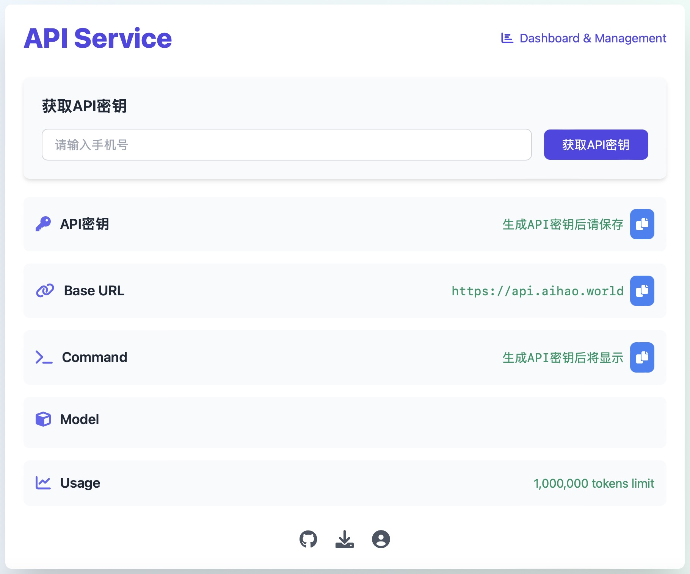

# API Service

一个轻量化的API请求中转系统。

## 功能特点

- 支持多种LLM模型接入
- 基于手机号的API密钥管理
- 实时用量统计和限制
- 支持流式响应

## 快速开始

1. 安装依赖

```bash
pip install -r requirements.txt
```

2. 配置环境变量

```bash
export ENV=production  # 生产环境必须
export SESSION_SECRET_KEY=your-secure-key  # 生产环境必须
```

3. 运行服务

```bash
python -m app.main
```

## API文档

### 管理接口

- `GET /` - 首页,生成API密钥


- `GET /manage-keys` - API密钥管理


- `GET /get-usage` - 用量统计


### LLM接口

- `POST /v1/chat/completions` - 聊天补全
- `POST /v1/completions` - 文本补全

## 配置文件

1. api_keys_usage.json - API密钥配置

```json
{
  "api-key": {
    "usage": 0,
    "limit": 300000,
    "reqs": 0,
    "code_reqs": 0,
    "created_at": "2024-02-04 12:00:00",
    "last_used": null,
    "phone": "139xxxxxxxx"
  }
}
```

2. llm_servers_list.json - LLM服务器配置

```json
{
  "server-url": {
    "model": {
      "public-model-name": "actual-model-name"
    },
    "device": "device-info",
    "apikey": "optional-api-key"
  }
}
```

3. serve_models_list.json - Serve模型列表

```json
{
  "models": [
    "deepseek-chat",
    "deepseek-reasoner",
    "moonshot-v1-8k"
  ]
}
```
