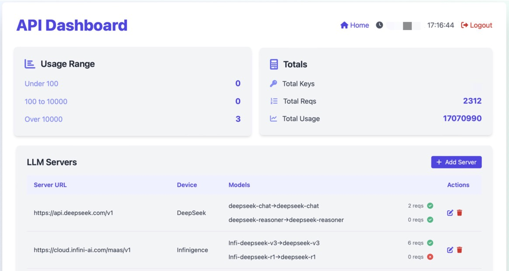

# API Service

一个轻量化的API请求中转系统。

## 功能特点

- 支持多种LLM模型接入
- 基于手机号的API密钥管理
- 实时用量统计和限制
- 支持流式响应

## 快速开始

1. 安装依赖

```bash
pip install -r requirements.txt
```

2. 配置环境变量

```bash
export ENV=production  # 生产环境必须
export SESSION_SECRET_KEY=your-secure-key  # 生产环境必须
```

3. 运行服务

```bash
python -m app.main
```

## 性能测试

`scripts/llm_benchmark.py` 提供了LLM API的性能测试工具，可以测量延迟和吞吐量。

### 测试方法

1. 安装额外依赖 (如果尚未安装):

```bash
pip install httpx
```

2. 运行基准测试:

```bash
python scripts/llm_benchmark.py \
  --base-url http://your-api-server \
  --api-key your-api-key \
  --model your-model-name
```

3. 可选参数:

- `--latency-requests`: 延迟测试请求数 (默认: 10)
- `--throughput-requests`: 吞吐量测试总请求数 (默认: 100)
- `--concurrency`: 吞吐量测试并发数 (默认: 10)
- `--timeout`: 请求超时时间(秒) (默认: 30)
- `--connect-timeout`: 连接超时时间(秒) (默认: 10)

### 结果解读

- **延迟测试**: 测量连续请求的平均/最小/最大响应时间
- **吞吐量测试**: 测量并发请求的处理能力(请求数/秒)

测试完成后会输出类似结果:

```
=== Running Latency Test ===
Average latency: 0.4523s
Min latency: 0.4011s  
Max latency: 0.5214s

=== Running Throughput Test ===  
Requests per second: 23.45
Successful requests: 98/100
Time elapsed: 4.18s
```

## API文档

### 管理接口

- `GET /` - 首页,生成API密钥


- `GET /get-usage` - 信息管理



- `GET /models` - 获取模型列表

### LLM接口

- `POST [/v1]/chat/completions` - 聊天补全
- `POST [/v1]/completions` - 文本补全
- `POST [/v1]/embeddings` - 文本向量化

## 配置文件

1. api_keys_usage.json - API密钥配置

```json
{
  "api-key": {
    "usage": 0,
    "limit": 300000,
    "reqs": 0,
    "created_at": "2024-02-04 12:00:00",
    "last_used": null,
    "phone": "139xxxxxxxx"
  }
}
```

2. llm_servers_list.json - LLM服务器配置

```json
{
  "server-url": {
    "model": {
      "public-model-name": {
        "name": "actual-model-name",
        "reqs": 0,
        "status": true
      }
    },
    "device": "device-info",
    "apikey": "optional-api-key"
  }
}
```
